# 🚀 Automated Multi-Node Kubernetes (v1.34) Local Testing Lab

This repository contains a fully automated, production-grade local Kubernetes environment orchestration pipeline. Utilizing **Vagrant** and **VirtualBox** for virtual compute generation alongside **Ansible** for declarative configuration management, it delivers a zero-touch cluster bootstrap cycle right on a local Linux host machine.

[[_TOC_]]

---

## 🏗️ Lab Architecture & Topology

The environment deploys a decoupled, 3-node architecture running on an isolated Host-Only internal subnet (`192.168.56.0/24`), while keeping external management workflows highly accessible.

| Node Name | Node Role | Host Private Network IP | Resources (VBox) | Core Runtime Components |
| :--- | :--- | :--- | :--- | :--- |
| **`controller`** | Control Plane | `192.168.56.10` | 2 vCPU / 4GB RAM | Kube-APIServer, Etcd, Helm 3, K8s Web UI |
| **`worker1`** | Worker Node | `192.168.56.11` | 2 vCPU / 4GB RAM | Containerd, Kubelet, Kube-Proxy |
| **`worker2`** | Worker Node | `192.168.56.12` | 2 vCPU / 4GB RAM | Containerd, Kubelet, Kube-Proxy |

### Operational Network Flow Map

```mermaid
flowchart TD
    Workstation[💻 ThinkPad Host Workstation]
    Gateway[🔒 Secure Background SSH Gateway Tunnel<br/>port 6443:192.168.56.10:6443]
    API[☸️ Kube API Server<br/>192.168.56.10:6443]
    WebUI[🪪 Kong Ingress Proxy Service<br/>Static NodePort: 32443]
    Dashboard[📊 Kubernetes Web Dashboard App]

    Workstation -->|kubectl commands| Gateway
    Gateway --> API
    Workstation -->|Browser Access| WebUI
    WebUI --> Dashboard

    style Workstation fill:#1f232a,stroke:#38bdf8,stroke-width:2px;
    style Gateway fill:#1f232a,stroke:#a855f7,stroke-width:2px;
    style API fill:#1f232a,stroke:#10b981,stroke-width:2px;
    style WebUI fill:#1f232a,stroke:#f59e0b,stroke-width:2px;
    style Dashboard fill:#1f232a,stroke:#ec4899,stroke-width:2px;
```



---

## 🛠️ Advanced Engineering Safeguards Implemented

This repository natively resolves several classic network routing and configuration pitfalls common to multi-node virtual environments:

*   **Vagrant Multi-Interface CNI Fix:** Standard Vagrant deployments route default container tracking traffic over the `eth0` NAT network card interface, causing Flannel to isolate pod-to-pod mesh tunnels. The custom `kube-flannel.yml.j2` overrides this dynamically using `--iface-regex=192.168.56.*` to force CNI communications onto the stable Host-Only adapter.
*   **Persistent Dashboard Port Anchor:** Upstream legacy Dashboard Helm charts strip values-defined target ports from their underlying Kong gateway manifest loops. This codebase appends a structural API pipeline JSON merge-patch (`kubectl patch`) to instantly anchor access to a predictable, permanent port (**`32443`**).
*   **Automated Background Gateway Tunneling:** The orchestration engine initializes a background SSH daemon thread (`ssh -g -f -N -L`) mapping incoming local router requests straight into your VirtualBox loopback adapter on port `2222`. This grants external devices on your physical home network secure management control over your testing lab safely.

---

## 📦 Prerequisites

Before executing the provisioning automation pipeline, ensure the following tools are installed on your host workstation terminal:

*   **VirtualBox Engine** (>= 7.0 recommended)
*   **Vagrant CLI Binary**
*   **Ansible Core Automation Suite**

---

## 🚀 Quick Start (Zero-Touch Deployment)

To deploy the entire multi-node environment, configure networking parameters, stand up your container networks, and deploy the admin web console hands-free, simply fire up the shortcut deployment engine:

```bash
# Execute the full end-to-end automated environment build
./.shortcuts/create_cluster
```

> ℹ️ **NOTE:** The script automatically detects if an existing lab is running. If no cluster is found, it automatically clears stale SSH host keys, provisions the VMs, patches the kernel settings, initializes the control plane, hooks up the workers, and surfaces your admin access key token.

---

## 🕹️ Granular Operational Controller Engine

For step-by-step troubleshooting, testing adjustments, or individual service updates, use the wrapper utility script `./00_manage_cluster`.

```bash
Usage: ./00_manage_cluster [option]
```

### Supported Commands

#### Infrastructure Layer (Vagrant)
*   `up`      : Boots the base VirtualBox Linux systems.
*   `status`  : Displays current runtime profiles of the lab VMs.
*   `destroy` : Safely terminates all virtual compute layers and drops background gateway network tunnels cleanly.

#### Supporting Operations (Ansible Verification)
*   `cleanup` : Purges obsolete server host signatures dynamically from your host's local SSH `known_hosts` index file.
*   `ping`    : Verifies active Ansible communication readiness to all node backends.
*   `reboot`  : Triggers an orderly system restart across the entire machine group.

#### Cluster Core Setup Steps
*   `install` : Installs Containerd container runtimes and patches native pinned `v1.34` Kubernetes system packages.
*   `prep`    : Loads required kernel subsystems (`overlay`, `br_netfilter`) and configures system `sysctl` routing settings.
*   `init`    : Sets up your master node control plane via `kubeadm` and saves a cluster token on your laptop.
*   `join`    : Orchestrates your workers to register themselves into the master node cluster topology.
*   `cni`     : Builds the customized, host-only isolated Flannel Container Network Interface topology.

#### Optional Add-ons
*   `dashboard` : Provisions Helm, fixes idempotency logging using `helm-diff`, deploys the web management panel, handles RBAC administrative profile setups, and locks it down to a predictable static NodePort.

---

## 🔐 Accessing the Cluster Web Console

Once the script prints out your deployment execution output successfully, you can log directly into your visual cluster dashboard environment:

1. Open your web browser and head straight to:
   ```text
   [https://192.168.56.10:32443](https://192.168.56.10:32443)
   ```
2. **Handle TLS Warnings:** Your browser will prompt an internal self-signed SSL warning. Click **Advanced** -> **Proceed (unsafe)**. This is completely normal for isolated local environments utilizing the dashboard's embedded self-signed encryption keys.
3. Select the **Token** authentication approach method on the login portal.
4. Copy the long authentication token string block printed out at the end of your playbook execution run (starting with `eyJhbGciOi...`), paste it into the field, and sign right in!


flowchart TD
    Workstation[💻 ThinkPad Host Workstation]
    Gateway[🔒 Secure Background SSH Gateway Tunnel<br/>port 6443:192.168.56.10:6443]
    API[☸️ Kube API Server<br/>192.168.56.10:6443]
    WebUI[🪪 Kong Ingress Proxy Service<br/>Static NodePort: 32443]
    Dashboard[📊 Kubernetes Web Dashboard App]

    Workstation -->|kubectl commands| Gateway
    Gateway --> API
    Workstation -->|Browser Access| WebUI
    WebUI --> Dashboard

    style Workstation fill:#e0f2fe,stroke:#38bdf8,stroke-width:2px,color:#000;
    style Gateway fill:#f3e8ff,stroke:#a855f7,stroke-width:2px,color:#000;
    style API fill:#d1fae5,stroke:#10b981,stroke-width:2px,color:#000;
    style WebUI fill:#fef3c7,stroke:#f59e0b,stroke-width:2px,color:#000;
    style Dashboard fill:#fce7f3,stroke:#ec4899,stroke-width:2px,color:#000;
